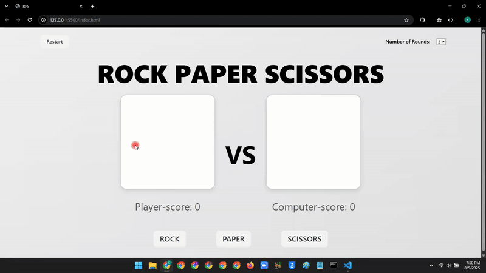

# Rock Paper Scissors Game

A browser-based implementation of the classic **Rock Paper Scissors** game with modern UI feedback and match series support.

[Play the Game](https://kelvinaddy.github.io/R-P-S/)

## Features

- Play against the computer
- Real-time score tracking
- “Best of” match series selection
- Visual feedback for wins, losses, and draws
- Smooth countdown and game flow animations

## 📸 Preview

## Tech Stack

- HTML5
- CSS3
- JavaScript (ES6+)

## Lessons Learned

- Practiced DOM manipulation and event-driven programming
- Explored functional refactoring and state management in JavaScript

## Improvements

- Add animations and sound effects
- Mobile-first UX tweaks
